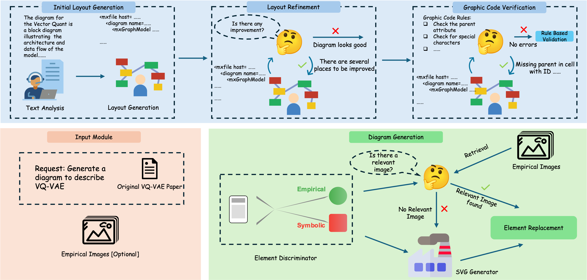

# [SCISKETCH: An Open-source Framework for Automated Schematic Diagram Generation in Scientific Papers](https://github.com/yale-nlp/SciSketch)

Official implementation of **SCISKETCH**, an open-source, modular framework for generating high-quality schematic diagrams directly from scientific papers. It leverages the power of large foundation models in a two-stage pipeline to transform research content into structured, editable, and visually appealing diagrams.

<br>

<br>

## An overview of SCISKETCH

- In the diagram layout planning stage, given the parsed paper content text, the caption and the optional empirical images, the text analysis module extracts related information and generates the diagram description and then layout generate a <i>initial diagram layout plan</i>. Then, the layout refinement module and code verification module iteratively refines the diagram plan.
- In the second diagram generation stage, selected components are replaced with svg icons or the provided images to make the diagram look better.

## 🚀 Getting Started

### 1. Clone the repository

```bash
git clone https://github.com/yale-nlp/SciSketch.git
cd scisketch
```

### 2. Install dependencies
We recommend using Python 3.10+ and venv or conda.
```bash
pip install -r requirements.txt
```

### 3. Prepare for the input
Prepare the parsed paper content and put it under `samples/parsed_papers` directory. In this project, we use [scipdf_parser](https://github.com/titipata/scipdf_parser) to parse the pdf. Put the empirical images into `input_images` folder

### 4. Add foundation model credentials
Put the foundation model credentials in the `.env` file including `API_BASE`, `API_KEY`,`API_TYPE`,`API_VERSION`

### 5. Run locally
```bash
bash bin/generate_diagrams.sh --sample_id paper_name
```

## 🧱 Project Structure
```bash
SciSketch/
├── bin/                        # Scripts to generate the diagram
│   ├── generate_diagrams.sh
├── input_images/               # Directory to store the empirical images 
├── samples/                    # Directory to store the parsed paper contents
│   ├── parsed_papers.sh
├── srs/
│   ├── configs.py               # configurations including foundation model for each module
│   ├── custom_main.py           # main entry point
│   ├── diagram_handler.py       # handler for diagram generation
│   ├── file_util.py             # file related util functions
│   ├── foundation_model_util.py # foundation model related util functions
│   ├── prompts.py               # all the prompts used in the diagram generation
│   ├── string_util.py           # string related utils
│   ├── util.py                  # comman utils
│   ├── xml_util.py              # xml related utils
├── assets/                      # Images
├── requirements.txt
├── .env
└── README.md
```

## 📁 Demo Papers

You can try generating diagrams from the [hugging face spaces](https://huggingface.co/spaces/zihang93/SCISKETCH)
